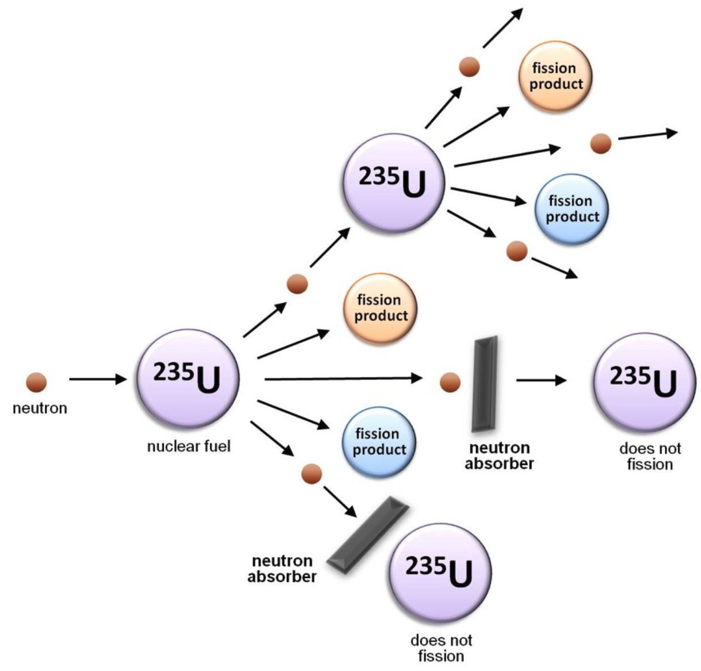
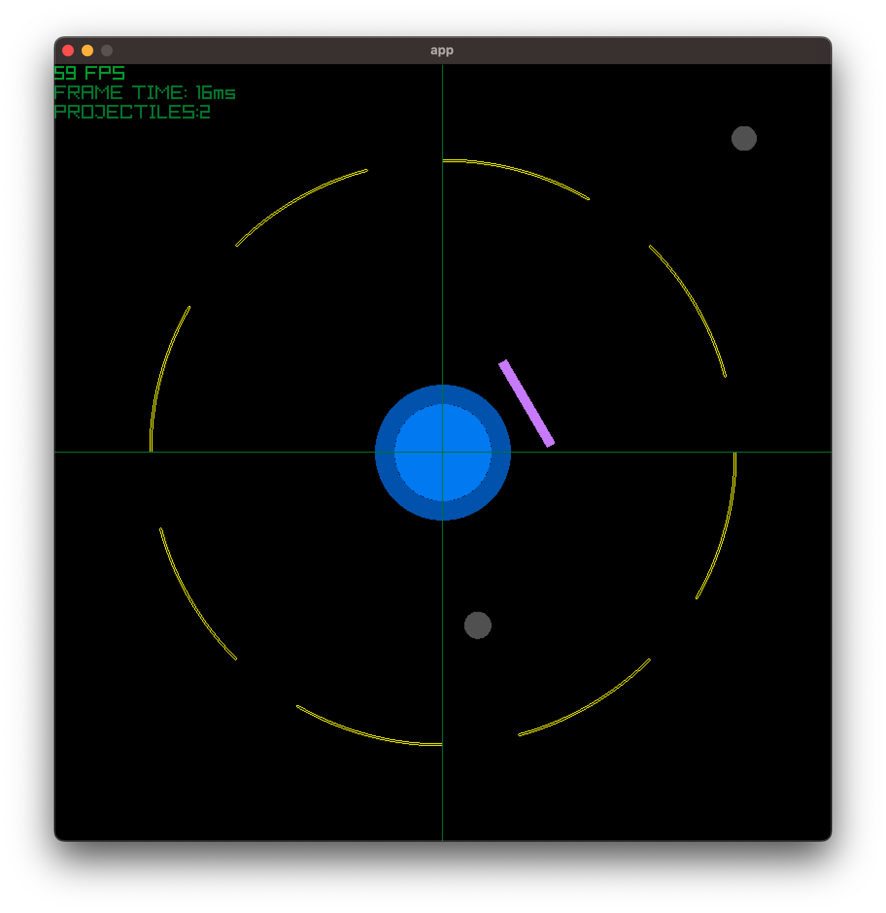
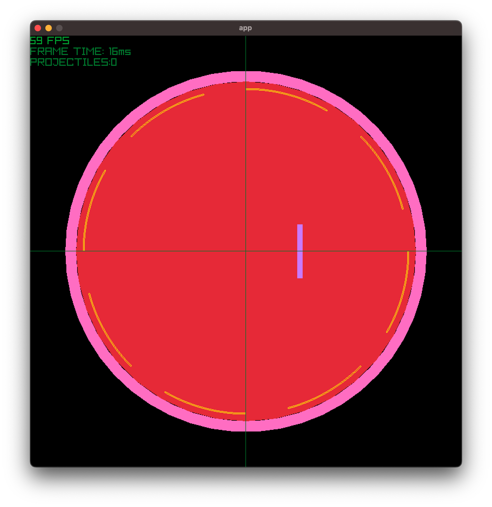

# wanna_jam_2026
repo for the 2026 "Do you wanna jam ?" on [itch.io](https://itch.io/jam/do-you-wanna-jam-2026)

THEME: `UNSTABLE`

# 2026-0816: day 1
- idea for the game: `unstable` as how unstable a Uranium 235 is in a nuclear chain reaction

- goal: avoid the chain reaction by blocking incoming fast neutrons

- light blue: inner part of the Uranium atom
- dark blue: outer part of the Uranium atom
- purple: shield. 
    - This is what the user controls with arrow keys
    - it rotates around the outer part
- grey ball: incoming fast neutron
- yellow circle: 
    - if the user fails to block the fast neutron, it is absorbed by Uranium
    - Uranium radius then increases
    - if the radius goes beyond the threshold, kaboom (aka game over) 

### TO DO:
- [ ] add collision detection between the shield and the neutrons: `+++`
- [ ] replace assets with pixel arts: `++`
- [ ] add sound effects: `+`
- [ ] add some sort of scoring: `+++`
- [ ] add start screen, settings (?): `++`

